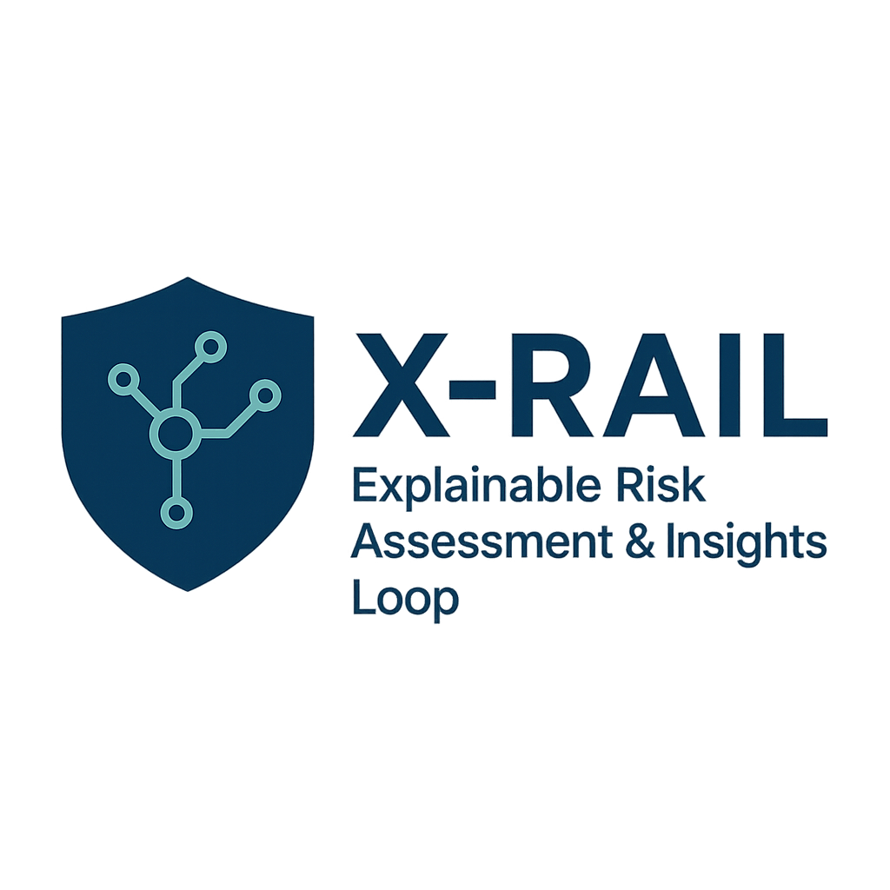
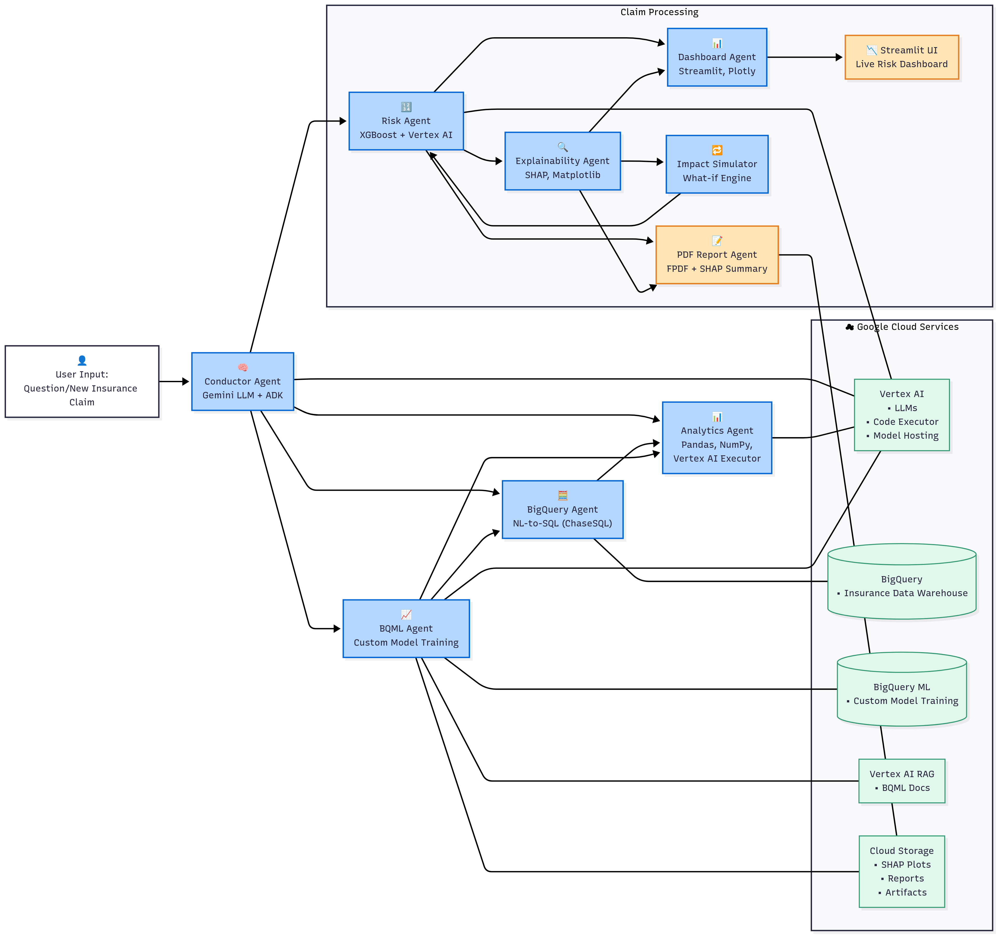

<div style="display: flex; justify-content: space-between; align-items: center;">
  
  <div style="text-align: right;">
    <h1>X-RAIL</h1>
    <p><em>Insurance Risk Analytics Multi-Agent System</em></p>
  </div>
</div>

A specialized insurance industry platform built with Google's Agent Development Kit (ADK) that provides intelligent risk assessment, claims analysis, and predictive modeling for insurance operations through a multi-agent architecture.

## 🚀 Insurance Industry Features

### Core Insurance Capabilities

- **Risk Assessment & Scoring**: Advanced risk evaluation with SHAP explainability for policy underwriting
- **Claims Analysis**: Intelligent claims processing and fraud detection
- **Customer Risk Profiling**: Comprehensive customer risk analysis based on demographics, vehicle data, and policy history
- **Premium Optimization**: Data-driven premium calculation and pricing recommendations
- **Policy Performance Analytics**: Deep insights into policy performance and profitability
- **Interactive Risk Dashboard**: Real-time risk visualization and decision support

### Insurance-Specific Sub-Agents

<div align="center">
  
  <p><em>X-RAIL Multi-Agent Architecture for Insurance Risk Analytics</em></p>
</div>

- **Risk Agent**: Specialized insurance risk assessment with explainable AI
- **Claims Analytics Agent**: Claims pattern analysis and fraud detection
- **Customer Profiling Agent**: Customer segmentation and risk categorization
- **Policy Analytics Agent**: Policy performance and profitability analysis

## 🏗️ Insurance Data Architecture

```
data_science/
├── agent.py              # Main insurance analytics orchestrator
├── prompts.py            # Insurance-specific agent instructions
├── tools.py              # Insurance analytics tools
├── sub_agents/           # Specialized insurance agents
│   ├── risk_agent/       # Risk assessment & scoring
│   ├── bigquery/         # Insurance data queries
│   ├── analytics/        # Claims & policy analysis
│   └── bqml/            # Predictive modeling for insurance
└── utils/               # Insurance data utilities
```

## 📋 Prerequisites

- Python 3.12+
- Google Cloud Platform account
- BigQuery access with insurance datasets
- Poetry (for dependency management)

## 🛠️ Installation

1. **Clone the repository**

   ```bash
   git clone <repository-url>
   cd data_science
   ```

2. **Install dependencies using Poetry**

   ```bash
   poetry install
   ```

3. **Set up environment variables**

   ```bash
   cp .env.example .env
   # Edit .env with your insurance data configuration
   ```

4. **Configure Google Cloud credentials**
   ```bash
   gcloud auth application-default login
   ```

## 🚀 Quick Start

### Running the Insurance Analytics Platform

```bash
# Start the FastAPI server
poetry run python main.py
```

The application will be available at `http://localhost:8080`

### Running the Risk Dashboard

```bash
# Start the Streamlit risk dashboard
cd Streamlitapp
streamlit run dashboard_ui.py
```

## 📊 Insurance Use Cases

### Risk Assessment & Underwriting

```
"Assess the risk profile for a 35-year-old engineer driving a 2020 Toyota Camry"
"Calculate risk score for a comprehensive policy in Metropolis"
"Analyze risk factors for high-value vehicle policies"
```

### Claims Analysis

```
"What are the most common claims patterns by vehicle brand?"
"Identify potential fraud indicators in recent claims"
"Analyze claims frequency by geographic region"
```

### Customer Analytics

```
"Segment customers by risk level and profitability"
"Identify high-risk customer profiles"
"Analyze customer retention patterns by policy type"
```

### Policy Performance

```
"Calculate loss ratios by policy type and region"
"Analyze premium adequacy across different segments"
"Identify profitable vs. unprofitable policy categories"
```

## 🛡️ Risk Analysis Format

The system accepts comprehensive risk assessment requests in JSON format:

```json
{
  "input_data": {
    "age": 40,
    "income": 85900,
    "vehicle_age": 3,
    "vehicle_value": 75000,
    "premium_amount": 1200,
    "vehicle_brand": "Toyota",
    "occupation": "engineer",
    "city": "Metropolis",
    "policy_type": "Comprehensive",
    "gender": "M"
  }
}
```

## 🔧 Insurance Data Configuration

### Environment Variables

- `ROOT_AGENT_MODEL`: Model configuration for insurance analytics
- `GOOGLE_CLOUD_PROJECT`: Your GCP project ID
- `BIGQUERY_DATASET`: Insurance datasets (customers, policies, claims)

### Insurance Data Schema

The system automatically loads insurance-specific BigQuery schema including:

- Customer demographics and profiles
- Policy details and coverage information
- Claims history and patterns
- Vehicle information and risk factors

## 📈 Secondary Data Analysis Capabilities

### General Analytics

- **Natural Language to SQL**: Convert queries to BigQuery SQL
- **Statistical Analysis**: Advanced data science computations
- **BigQuery ML Integration**: Machine learning model training and inference
- **Data Visualization**: Interactive charts and dashboards

### Multi-Agent Architecture

- **BigQuery Agent**: Handles insurance data queries and schema management
- **Analytics Agent**: Performs statistical analysis and data processing
- **BQML Agent**: Manages predictive modeling for insurance scenarios

## 🧪 Testing

Run the insurance analytics test suite:

```bash
poetry run pytest
```

## 📁 Project Structure

```
├── data_science/           # Main insurance analytics package
│   ├── agent.py           # Insurance analytics orchestrator
│   ├── prompts.py         # Insurance-specific instructions
│   ├── tools.py           # Insurance analytics tools
│   └── sub_agents/        # Specialized insurance agents
├── Streamlitapp/          # Risk visualization dashboard
├── deployment/            # Insurance platform deployment
├── eval/                  # Risk model evaluation
├── tests/                 # Insurance analytics tests
└── shap_outputs/          # Risk explainability visualizations
```

## 🤝 Contributing

1. Fork the repository
2. Create a feature branch
3. Make your changes
4. Add tests for new insurance functionality
5. Submit a pull request

## 📄 License

This project is licensed under the Apache License 2.0 - see the LICENSE file for details.

## 🆘 Support

For insurance analytics issues and questions:

- Check the documentation in the `docs/` directory
- Review the test examples in `tests/`
- Open an issue on the repository

## 🔄 Development

### Adding New Insurance Agents

1. Create a new directory in `data_science/sub_agents/`
2. Implement the insurance agent following the existing pattern
3. Register the agent in the main agent configuration
4. Add appropriate insurance-specific tests

### Extending Insurance Analytics

1. Add new insurance tools to `data_science/tools.py`
2. Update insurance agent instructions in `data_science/prompts.py`
3. Test the new insurance functionality

## 📈 Insurance Platform Performance

The system is optimized for:

- **Risk Assessment Speed**: Fast risk scoring for real-time underwriting decisions
- **Claims Processing**: Efficient claims analysis and fraud detection
- **Scalability**: Multi-agent architecture for high-volume insurance operations
- **Compliance**: Built-in audit trails and explainability for regulatory requirements
- **Integration**: Seamless connection with existing insurance systems and databases
